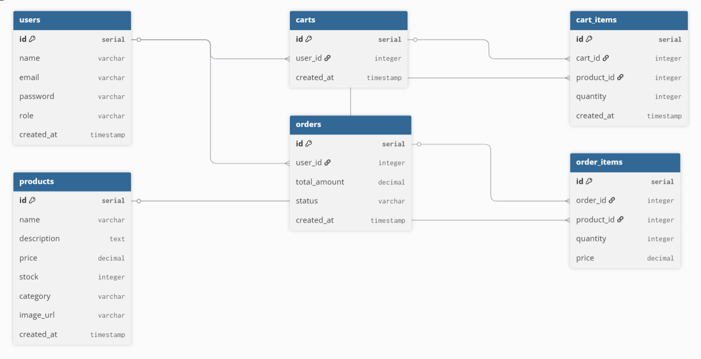
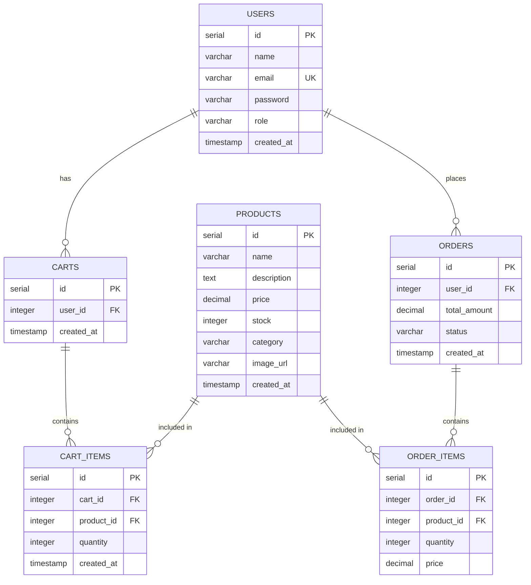

# E-commerce Database Schema - ER Diagram

## Visual ER Diagram

## Database Structure (Mermaid)

## Table Descriptions

### USERS
- **Primary Key**: `id`
- **Unique Constraints**: `email`
- **Description**: Stores user account information
- **Roles**: `customer` (default), `admin`

### PRODUCTS
- **Primary Key**: `id`
- **Description**: Product catalog with pricing and inventory
- **Features**: Searchable by name, filterable by category and price

### CARTS
- **Primary Key**: `id`
- **Foreign Keys**: `user_id` → USERS(id)
- **Description**: Shopping cart container for each user
- **Note**: One cart per user

### CART_ITEMS
- **Primary Key**: `id`
- **Foreign Keys**: 
  - `cart_id` → CARTS(id)
  - `product_id` → PRODUCTS(id)
- **Description**: Individual items in a cart with quantities
- **Cascade**: Deletes when cart is deleted

### ORDERS
- **Primary Key**: `id`
- **Foreign Keys**: `user_id` → USERS(id)
- **Description**: Order records with total amount and status
- **Status Values**: `pending`, `processing`, `completed`, `cancelled`

### ORDER_ITEMS
- **Primary Key**: `id`
- **Foreign Keys**: 
  - `order_id` → ORDERS(id)
  - `product_id` → PRODUCTS(id)
- **Description**: Products included in an order
- **Note**: Stores price at time of order (historical record)

## Relationships

1. **User ↔ Cart**: One-to-Many (One user can have one active cart)
2. **User ↔ Orders**: One-to-Many (One user can place multiple orders)
3. **Cart ↔ Cart Items**: One-to-Many (One cart contains multiple items)
4. **Product ↔ Cart Items**: One-to-Many (One product can be in multiple carts)
5. **Order ↔ Order Items**: One-to-Many (One order contains multiple items)
6. **Product ↔ Order Items**: One-to-Many (One product can be in multiple orders)

## Indexes

- `users.email` - UNIQUE index for fast login lookups
- `cart_items(cart_id, product_id)` - Composite index for cart operations
- `orders.user_id` - Index for fetching user order history
- `products.category` - Index for category filtering
- `products.price` - Index for price range queries

## Security Features

- Passwords are hashed using bcrypt before storage
- JWT tokens used for authentication (not stored in database)
- Role-based access control enforced at application level
- Admin-only operations protected by middleware
